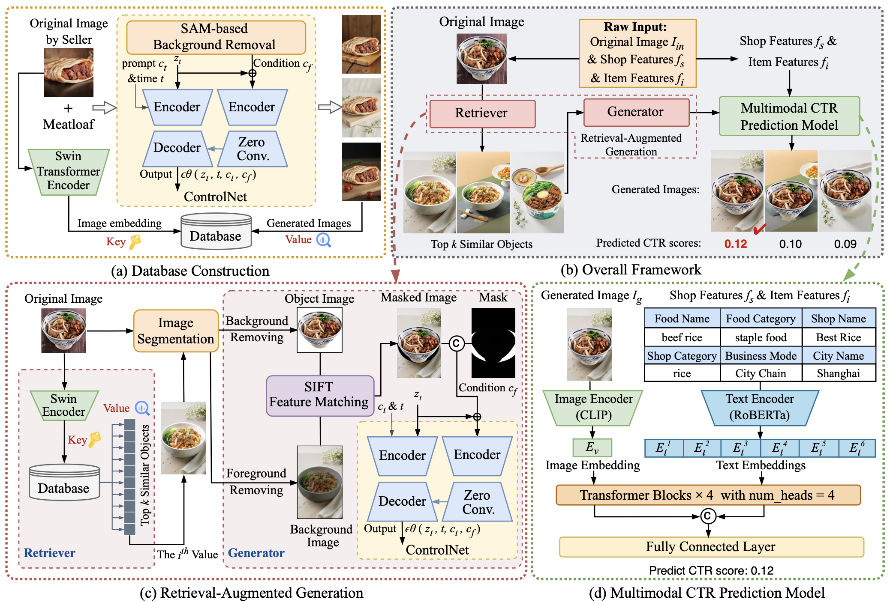

# FoRAGe

[KDD '25 Applied Data Science Track] FoRAGe: High-CTR Food Image Synthesis with Retrieval-Augmented Diffusion Model

[Abstract]

The demonstrable commercial value of high Click-Through Rates (CTR) imagery for food delivery platforms necessitates strategies for visually compelling image generation. Our investigations reveal a positive correlation between appropriately chosen backgrounds in food images and subsequent user engagement, yet a dedicated methodology for high-CTR food image synthesis remains absent. In this paper, we propose **FoRAGe**, a novel high-CTR **Fo**od **R**etrieval-**A**ugmented **Ge**neration pipeline leveraging ControlNet based on Stable Diffusion. Specifically, we construct a comprehensive food image database encompassing a diverse range of background environments. During image generation, FoRAGe retrieves high-quality background exemplars featuring analogous food subjects from the database and employs the retrieved backgrounds as conditions to guide image synthesis via the ControlNet model. Subsequently, a multimodal CTR prediction model is utilized to identify and select optimal images for deployment. Online A/B testing results demonstrate a statistically significant increase in CTR for images generated by our proposed pipeline, and ablation studies further elucidate the impact of different strategies and configurations. 

 

We extend our sincere thanks to the developers and maintainers of the open-source projects that made this work possible:

- [openai/clip-vit-base-patch32](https://huggingface.co/openai/clip-vit-base-patch32)
- [hfl/chinese-roberta-wwm-ext](https://huggingface.co/hfl/chinese-roberta-wwm-ext)
- [aspis/swin-finetuned-food101](https://huggingface.co/aspis/swin-finetuned-food101)
- [yahoo-inc/photo-background-generation](https://huggingface.co/yahoo-inc/photo-background-generation)